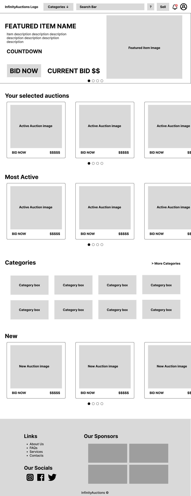
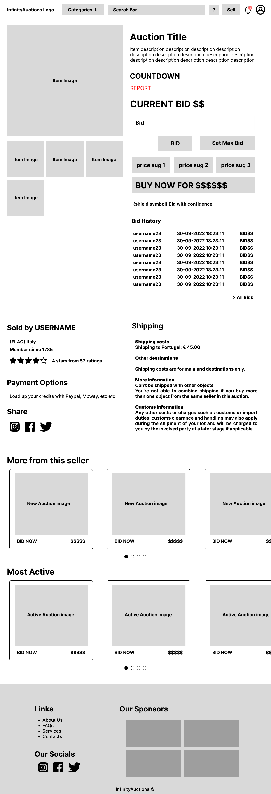

# ER: Requirements Specification Component

> Bidding the future and Selling the past.

## A1: InfinityAuctions

  InfinityAuctions is a world-class product for online auctions. It is currently in development by a small but mighty software company in the hopes of revolutionising the way online auctions are handled nowadays.

  The main goal of the project is the development of a web-based information system for managing lots, handling absentee bids and bringing users together, from bidders to auction owners. This is a tool, or better yet, an experience, to be used by art collectors, phone sellers, vintage lovers and everyone in between. After the release, a team of administrators will be put in action, which will keep the users safe by managing auctions, cancelling inappropriate lots and, hopefully, will manage auction reports, as well as, changing the categories that the lot belongs to, to improve the user experience.

  All our users will have their corner in our app. They will be able to authenticate into our system and from there we will give you all the tools you need to manage your account, as well as your bids and lots.

  In our product, we have several types of users: the administrators that can manage and delete auctions; the auction owner that edits the auction details (provides a description of the item to be auctioned alongside some photos and defines the categories), manages the auction status and has the power to cancel the auction; the bidder can bid in the auctions, rate the seller and view the bidding history for each auction. Any authenticated user (bidders and sellers) can create new auctions, mark and view auctions followed, easily access auctions in which the user is bidding, add credit to the account and check its previous bidding history. Furthermore, non-authenticated users can access the information on active auctions and search them by using a search box and for more specificality there will be filters for finding any needle in our massive haystack of auctions.

  The platform will have a mind-blowing user-friendly design, responsive to all platforms, from smartphones to desktops and all sizes in between. Our goal is in creating simple navigation to be used with the most complex and revolutionary online auction house. It is in our best interest to provide you with the best tools in the market, such as advanced search features. We thrive in making amazing user experiences and we guarantee that auctioning will never be a hassle.

## A2: Actors and User stories

> This artifact defines the actors and their user stories, serving as agile documentation of the project’s requirements.

### 1. Actors

>  

| Identifier | Description | 
|------------|-------------| 
| User | Generic user that has access to public information, such as active auctions and user profiles. | 
| Visitor | Unauthenticated user that can register itself (sign-up) or sign-in in the system | 
| Authenticated User | Authenticated user that can consult information, create auctions, follow auctions, bid in auctions and view activities such as bidding history and followed auctions. | | Bidder | Authenticated user that can rate a seller, receives auction notifications, updates the bid and view auction bidding history | 
| Auction owner | Authenticated user that is able to edit an auction, manage auctions status and cancel auctions | | Administrator | Responsible for managing auctions and canceling auctions when he/she sees fit. Can also manage auction reports and categories. |
 | OAuth API | External OAuth API that can be used to register or authenticate into the system. |

### 2. User Stories

> User stories organized by actor.\
> For each actor, a table containing a line for each user story, and for each user story: an identifier, a name, a priority, and a description (following the recommended pattern).

#### 2.1. Visitor
| Identifier | Name | Priority | Description |
|------------|------|----------|-------------|
| US01 | Sign-in | High | As a Visitor, I want to authenticate into the system, so that I can access privileged information. |
| US02 | Sign-up | High | As a Visitor, I want to register myself into the system, so that I can authenticate myself into the system. |
| US03 | OAuth API Sign-in | Low | As a Visitor, I want to sign-in through my Google account, so that I can authenticate myself into the system. |
| US04 | OAuth API Sign-up | Low | As a Visitor, I want to register a new account linked to my Google account, to easily register myself in the system. |

#### 2.2. User
| Identifier | Name | Priority | Description |
|------------|------|----------|-------------|
| US11 | See Home page | High | As a User, I want to access the Home page, so that I can see a brief presentation of the website |
| US12 | See About page | High | As a User, I want to access the About page, so that I can see a complete description of the website and its creators. |
| US13 | Consult Services | High | As a User, I want to access the services information, so that I can see the website's services. |
| US14 | Consult FAQ | High | As a User, I want to access the FAQ, so that I can get quick answers to common questions. |
| US15 | Consult Contacts | High | As a User, I want to access contacts, so that I can come in touch with the platform creators. |
| US16 | Search | High | As a User, I want to search the platform keywords, so that I can quickly find goods and services that I am looking for. |
| US17 | Filters | Medium | As a User, I want to search an auction within a certain criteria, so that I can quickly find goods and services that I am looking for. |
| US18 | Report auctions | Medium | As a User, I want to be able to report auctions I find inappropriate, so that I can notify administrators of a possible misuse of the platform. |
| US19 | Report users | Medium | As a User, I want to be able to report other users I find inappropriate, so that I can notify administrators of a possible misuse of the platform. |
| US20 | Featured items | Medium | As a User, I want to have a shortcut to items featured in the platform, so that I can find interesting auctions. |
| US21 | Most active auctions | Medium | As a User, I want to have a shortcut to the most active auctions in the platform, so that I can see what is currently popular. |
| US22 | New auctions | Medium | As a User, I want to have a shortcut to the most recent auctions in the platform, so that I can see the new business opportunities. |
| US23 | Social networks | Low | As a User, I want to have a shortcut to the platform's social media accounts. |
| US24 | More from this seller | Low | As a User, I want to access other auctions by the same seller whose auction I am on, so that I can check if the seller has any other item of interest to me. |

#### 2.3. Authenticated user
| Identifier | Name | Priority | Description |
|------------|------|----------|-------------|
| US31 | Create auctions | High | As an Authenticated user, I want to create auctions, so that I can auction a product to other users. |
| US32 | Bid an auction | High | As an Authenticated user, I want to bid on auctions, so that I can set a new price for the product I am willing to buy. |
| US33 | View activity | High | As an Authenticated user, I want to view my account history, so that I can consult previous auctions, as well as those that I am bidding on or following. |
| US34 | Edit account | High | As an Authenticated user, I want to be able to edit my account, so that I can keep my personal data updated. |
| US35 | Bidding history | High | As a Bidder, I want to have access to the bidding history of a certain auction, so that I can study my approach to it and maximize the chances of winning it with a smaller bid. |
| US36 | View Users profile | High | As an Authenticated user, I want to be able to see other users' profiles, so that I can access their information. |
| US37 | Add funds to account | Medium | As an Authenticated user, I want to be able to add funds to my account, so that I can bid in the auctions. |
| US38 | Delete account | Medium | As an Authenticated user, I want to be able to delete my account, so that I can erase personal information from the platform. |
| US39 | Follow auctions | Medium | As an Authenticated user, I want to follow auctions, so that I can keep up to date with an auction in progress. |
| US40 | Wishlist | Medium | As a Authenticated user, I want to be able to add certain keywords and search strings to my Wishlist, so that I can quickly recall past searches. |
| US41 | Notification | Medium | As a Authenticated user, I want to be notified every time a new product that matches my Wishlist is auctioned, so that I can quickly go bid on it. |
| US42 | Control profile privacy | Low | As an Authenticated user, I want to be able to change my privacy settings, so that I can control what information other users see. |
| US43 | Withdraw funds | Low | As an Authenticated user, I want to be able to withdraw funds from my account, so that I can use the money earned by selling items. |

#### 2.4. Bidder
| Identifier | Name | Priority | Description |
|------------|------|----------|-------------|
| US51 | Update bid | High | As a Bidder, I want to update the bid, so that I can set a new competitive price for the product. |
| US52 | Notified on new bid on participating auction | Medium | As a Bidder, I want to be notified, so that I know the state of an auction where I’m bidding. |
| US53 | Notified on participating auction ended | Medium | As a Bidder, I want to be notified, so that I know when an auction in which I was bidding is over. |
| US54 | Notified on participating auction winner | Medium | As a Bidder, I want to be notified, so that I know when I won an auction. |
| US55 | Notified on followed auction canceled | Medium | As a Bidder, I want to be notified, so that I know when an auction in which I was bidding is canceled. |
| US56 | Notified on participating auction ending | Medium | As a Bidder, I want to be notified, so that I know when the auction is close to the end. |
| US57 | Rate a seller | Medium | As a Bidder, I want to rate a seller, so that I can give feedback about my experience. |
| US58 | Buy now | Medium | As a Bidder, I want to be able to buy the item immediately for the predefined asked price, so that I can guarantee I win the auction. |
| US59 | Max bid | Low | As a Bidder, I want to be able to set a max bid value, so that my biddings are made automatically. |

#### 2.5. Auction Owner
| Identifier | Name | Priority | Description |
|------------|------|----------|-------------|
| US61 | Edit auctions | High | As an Auction Owner, I want to edit auctions, so that I can edit the product I’m currently bidding. |
| US62 | Manage auction status | High | As an Auction Owner, I want to be able to manage my auction status so that I can change it when I see fit. |
| US63 | Cancel auction | High | As an Auction Owner, I want to be able to cancel my auctions so that my product no longer appears in the auction listing. |
| US64 | Notified on new bid on owned auction | Medium | As an Auction Owner, I want to be notified, so that I know the state of an auction I own. |
| US65 | Notified on owned auction ended | Medium | As an Auction Owner, I want to be notified, so that I know when an auction I own is over. |
| US66 | Notified on owned auction winner | Medium | As an Auction Owner, I want to be notified, so that I know when someone won one of my auctions. |
| US67 | Notified on owned auction canceled | Medium | As an Auction Owner, I want to be notified, so that I know when an auction in which I own is canceled. |
| US68 | Notified on owned auction ending | Medium | As an Auction Owner, I want to be notified, so that I know when the auction is close to the end. |
| US69 | Buy it now | Medium | As a Auction Owner, I want to be able to list my auction product for a very high desired price, so that the item can be bought immediately for the desired sum and ends the auction countdown. |

#### 2.6. Administrator
| Identifier | Name | Priority | Description |
|------------|------|----------|-------------|
| US71 | Manage auctions | High | As an Administrator, I want to manage auctions, so that I can alter multiple aspects of the auctions in the current auction list. |
| US72 | Cancel auctions | High | As an Administrator, I want to be able to cancel auctions, so that I can eliminate auctions that are infringing our policies. |
| US73 | Punish users | Medium | As an Administrator, I want to be able to temporarily block/unblock user accounts if they don't follow our policies, so that our policies are respected. |
| US74 | Delete user accounts | Medium | As an Administrator, I want to, in extreme cases, be able to delete a user account, so that our policies are respected. |
| US75 | Manage auction reports | Low | As an Administrator, I want to be able to manage auction reports, so that I can change multiple details in any auction report. |
| US76 | Manage categories | Low | As an Administrator, I want to be able to manage categories, so that I can create more categories and recategorize auctions. |

### 3. Supplementary Requirements

> Section including business rules, technical requirements, and restrictions.\
> For each subsection, a table containing identifiers, names, and descriptions for each requirement.

#### 3.1. Business rules
| Identifier | Name | Description |
|------------|------|-------------|
| BR01 | Conflicts of interest | Administrator accounts are independent of the user accounts, i.e. they cannot create or participate in auctions. |
| BR02 | Cancellation | An auction can only be canceled if there are no bids. |
| BR03 | Self biding | A user cannot bid on its own auction. |
| BR04 | Delete user | When an account gets deleted, user activity is saved, but all personal data is erased. |
| BR05 | Item Filtering | Items considered illegal to be sold (in the respective countries) can't be auctioned. |
| BR06 | Time Integrity | The ending date of a given auction, as well as its biddings, is greater or equal then the starting date. |

#### 3.2. Technical requirements
| Identifier | Name | Description |
|------------|------|-------------|
| TR01 | Availability | The system must be available 99 percent of the time in each 24-hour period. |
| **TR02** | **Usability** | **The system should be simple and easy to use. InfinityAuctions is designed to be used by users that are, at least, 18 years old, with or without technical experience, so a very good usability is a critical requirement.** |
| **TR03** | **Performance** | **The system should have short response times to make sure that auction prices are always up to date. A response time of over 1 second is unnaceptable because it can lead to poor user experience.** |
| TR04 | Web Application | The system should be implemented as a web application with dynamic pages (HTML5, JavaScript, CSS3 and PHP). |
| TR05 | Portability | The server-side system should work across multiple platforms (Linux, Mac OS, etc.). |
| **TR06** | **Security** | **The system shall protect information from unauthorized access through the use of an authentication and verification system. Since the system deals with banking details and money of our clients, this is of utmost importance.** |
| TR07 | Scalability | The system must be prepared to deal with the growth in the number of users and their actions. |
| TR08 | Ethics | The system must respect the ethical principles in software development (for example, personal user details, or usage data, should not be collected nor shared without full acknowledgement and authorization from its owner). |
| TR09 | Future Proof | A website designed following design patterns and with emphasis in modularity. Prepared to change payment operators and using new API's with ease. |
| TR10 | Database | The PostgreSQL database management system must be used, with a version of 11 or higher. |
| TR11 | Browser Portability | The website must work flawlessly and with all its features in Firefox(91.0), Chrome(107.0) and Safari(15.6.1). |

#### 3.3. Restrictions
| Identifier | Name | Description |
|------------|------|-------------|
| C01 | Deadline | The system should be ready to be used before Christmas time. |

---

## A3: Information Architecture

> Brief presentation of the artefact goals.

### 1. Sitemap

> Sitemap presenting the overall structure of the web application.\
> Each page must be identified in the sitemap.\
> Multiple instances of the same page (e.g. student profile in SIGARRA) are presented as page stacks.

### 2. Wireframes

> Wireframes for, at least, two main pages of the web application. Do not include trivial use cases.

#### UI01: Home Page

#### UI10: Auction Details

#### UI13: Search Results

---

## Revision history

Changes made to the first submission:

1. Item 1
2. ...

---

GROUP2271, 05/10/2022

* André Sousa, up202005277@fe.up.pt (Editor)
* Pedro Moreira, up201905429@fe.up.pt
* Pedro Fonseca, up202008307@fe.up.pt
* Vítor Cavaleiro, up202004724@edu.fe.up.pt