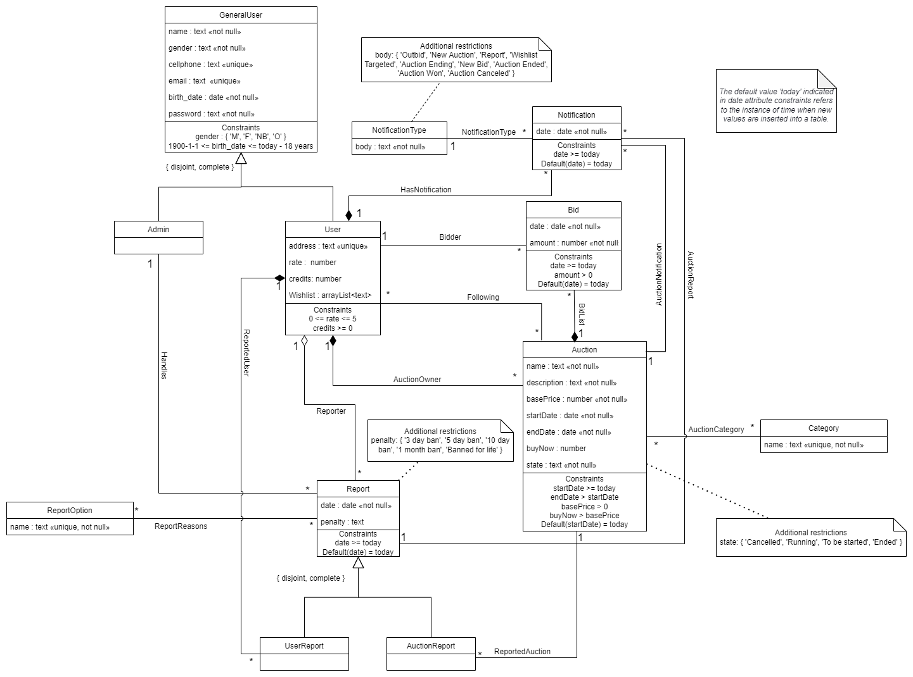

# EBD: Database Specification Component

> Bidding the future and Selling the past.

## A4: Conceptual Data Model

> The Conceptual Data Model contains the identification and description of the entities and relationships that are relevant to the database specification.

> A UML class diagram is used to document the model.

### 1. Class diagram

> UML class diagram containing the classes, associations, multiplicity and roles.  
> For each class, the attributes, associations and constraints are included in the class diagram.

> Additional restrictions and atribute domains that didn't fit in the class box were written in uml notes.



### 2. Additional Business Rules

- BR01. Administrator accounts are independent of the user accounts, i.e. they cannot create or participate in auctions.
- BR02. An auction can only be cancelled by its owner if there are no bids.
- BR03. A user cannot bid on its own auction.
- BR04. When an account gets deleted, user activity is saved, but all personal data is erased.
- BR05. Items considered illegal to be sold (in the respective countries) can't be auctioned.
- BR06. The ending date of a given auction, as well as its biddings, is greater or equal then the starting date.
- BR07. Bids can only be done while the auction is active.
- BR08. A user can not delete an account if any of its bids are the highest in an active auction.
- BR09. Only valid users (not deleted accounts) can bid.
- BR10. Bidders can not make bids below the currently highest bid.

---

## A5: Relational Schema, validation and schema refinement

> This artifact contains the Relational Schema obtained by mapping from the Conceptual Data Model. 
### 1. Relational Schema

> The Relational Schema includes the relation schemas, attributes, domains, primary keys, foreign keys and other integrity rules: UNIQUE, DEFAULT, NOT NULL, CHECK.  
> Relation schemas are specified in the compact notation:  

| Relation reference | Relation Compact Notation                        |
| ------------------ | ------------------------------------------------ |
| R01 | general_user( <ins>id</ins>, name **NN**, gender **CK** gender IN Gender, cellphone **UK**, email **UK**, birth_date **NN**, address **UK**, password **NN**, rate **CK** rate >= 0 AND rate <= 5, credits, wishlist, is_admin **NN** ) |
| R02 | bid( <ins>id</ins>, date **NN** **DF** Today, amount **NN**, user_id -> general_user **NN**, auction_id -> auction **NN**) |
| R03 | notification (<ins>id</ins>, date **DF** Today **NN**, type **NN** **CK** type IN Notification_type, user_id -> general_user **NN**, auction_id -> auction, report_id -> report) |
| R04 | auction (<ins>id</ins>, name **NN**, description **NN**, base_price **NN**, start_date **NN** **DF** Today, end_date **NN** **CK** start_date < end_date, buy_now, state **NN**, auction_owner_id -> general_user **NN** ) |
| R05 | category ( <ins>id</ins>, name **NN** **UK**) |
| R06 | auction_category ( <ins>category_id</ins> -> category, <ins>auction_id</ins> -> auction) |
| R07 | following ( <ins>user_id</ins> -> general_user, <ins>auction_id</ins>-> auction ) |
| R08 | report (<ins>id</ins>, date **DF** Today **NN**, penalty **CK** penalty IN Penalty, reported_user -> general_user, reporter -> general_user **NN** **CK** reported_user != reporter, auction_reported -> auction, admin_id -> general_user) |
| R09 | report_option ( <ins>id</ins>, name **NN** **UK**) |
| R10 | report_reasons ( <ins>id_report_option</ins> -> report_option, <ins>id_report</ins> -> report) |

* Legend:
  - **UK** = UNIQUE KEY
  - **NN** = NOT NULL
  - **DF** = DEFAULT
  - **CK** = CHECK

 
**Justification for Generalizations**
 | Generalization | Justification           |
| ----------- | --------------------------------------------- |
| **User / Admin / General User** | Since the differences between an User and an Admin are few, we chose to generalize this using null fields in certain columns, namely: address, rate, credits and wishlist. Furthermore, we added a collumn named "isAdmin" that is composed of boolean values and is used to check if a given user is an Admin or not.|
| **Reports / Auction Reports / User Reports** | Once again Auction reports share the vast majority of their attributes and therefore it makes more sense to simply use nulls to express the difference between both of them.|


### 2. Domains

> The specification of additional domains can also be made in a compact form, using the notation:  

| Domain Name | Domain Specification           |
| ----------- | ------------------------------ |
| Today | DATE DEFAULT CURRENT_DATE  |
| Notification_type | ENUM ('Outbid', 'New Auction', 'Report', 'Wishlist Targeted', ‘Auction Ending’, ‘New Bid’, ‘Auction Ended’, ‘Auction Won’, ‘Auction Canceled’ ) |
| State | ENUM ('Cancelled', 'Running', 'To be started', 'Ended') |
| Penalty | ENUM ('3 day ban', '5 day ban', '10 day ban', '1 month ban', 'Banned for life') |
| Gender | ENUM (‘M’, ‘F’, ‘NB’, ‘O’) |

### 3. Schema validation

> To validate the Relational Schema obtained from the Conceptual Model, all functional dependencies are identified and the normalization of all relation schemas is accomplished. Should it be necessary, in case the scheme is not in the Boyce–Codd Normal Form (BCNF), the relational schema is refined using normalization.  

<table>
<thead>
  <tr>
    <td colspan="4"> <strong> Table R01 </strong>(general_user)</td>
  </tr>
</thead>
<tbody>
  <tr>
    <td colspan="4"> <strong> Keys: </strong>{id}, {cellphone}, {email}, {address}</td>
  </tr>
  <tr>
    <td colspan="4"> <strong> Functional Dependencies </strong> </td>
  </tr>
  <tr>
    <td colspan="2">FD0101</td>
    <td colspan="2"> {id} -> {name, gender, cellphone, email, birth_date, address, password, rate, credits , wishlist, is_admin} </td>
  </tr>
  <tr>
    <td colspan="2">FD0102</td>
    <td colspan="2">{cellphone} -> {id, name, gender, email, birth_date, address, password, rate, credits , wishlist, is_admin}</td>
  </tr>
  <tr>
    <td colspan="2">FD0103</td>
    <td colspan="2">{email} -> {id, name, gender, cellphone, birth_date, address, password, rate, credits , wishlist, is_admin}</td>
  </tr>
    <tr>
    <td colspan="2">FD0104</td>
    <td colspan="2">{address} -> {id, name, gender, cellphone, email, birth_date, password, rate, credits , wishlist, is_admin}</td>
  </tr>
  <tr>
    <td colspan="2"><strong> Normal Form </strong> </td>
    <td colspan="2">BCNF</td>
  </tr>
</tbody>
</table>
 

<table>
<thead>
  <tr>
    <td colspan="4"> <strong> Table R02 </strong>(bid)</td>
  </tr>
</thead>
<tbody>
  <tr>
    <td colspan="4"> <strong> Keys: </strong>{id}</td>
  </tr>
  <tr>
    <td colspan="4"> <strong> Functional Dependencies </strong> </td>
  </tr>
  <tr>
    <td colspan="2">FD0201</td>
    <td colspan="2"> {id} -> {date, amount, user_id -> general_user, auction_id -> auction} </td>
  </tr>
  <tr>
    <td colspan="2"><strong> Normal Form </strong> </td>
    <td colspan="2">BCNF</td>
  </tr>
</tbody>
</table>

<table>
<thead>
  <tr>
    <td colspan="4"> <strong> Table R03 </strong>(notification)</td>
  </tr>
</thead>
<tbody>
  <tr>
    <td colspan="4"> <strong> Keys: </strong>{id}</td>
  </tr>
  <tr>
    <td colspan="4"> <strong> Functional Dependencies </strong> </td>
  </tr>
  <tr>
    <td colspan="2">FD0301</td>
    <td colspan="2"> {id} -> {date, type, user_id -> general_user, auction_id -> auction, report_id -> report} </td>
  </tr>
  <tr>
    <td colspan="2"><strong> Normal Form </strong> </td>
    <td colspan="2">BCNF</td>
  </tr>
</tbody>
</table>

<table>
<thead>
  <tr>
    <td colspan="4"> <strong> Table R04 </strong>(auction)</td>
  </tr>
</thead>
<tbody>
  <tr>
    <td colspan="4"> <strong> Keys: </strong>{id}</td>
  </tr>
  <tr>
    <td colspan="4"> <strong> Functional Dependencies </strong> </td>
  </tr>
  <tr>
    <td colspan="2">FD0401</td>
    <td colspan="2"> {id} -> {name, description, base_price, start_date, end_date, buy_now, state, auction_owner_id -> general_user} </td>
  </tr>
  <tr>
    <td colspan="2"><strong> Normal Form </strong> </td>
    <td colspan="2">BCNF</td>
  </tr>
</tbody>
</table>

<table>
<thead>
  <tr>
    <td colspan="4"> <strong> Table R05 </strong>(category)</td>
  </tr>
</thead>
<tbody>
  <tr>
    <td colspan="4"> <strong> Keys: </strong>{id}, {name}</td>
  </tr>
  <tr>
    <td colspan="4"> <strong> Functional Dependencies </strong> </td>
  </tr>
  <tr>
    <td colspan="2">FD0501</td>
    <td colspan="2"> {id} -> {name} </td>
  </tr>
   <tr>
    <td colspan="2">FD0502</td>
    <td colspan="2"> {name} -> {id} </td>
  </tr>
  <tr>
    <td colspan="2"><strong> Normal Form </strong> </td>
    <td colspan="2">BCNF</td>
  </tr>
</tbody>
</table>
 
<table>
<thead>
  <tr>
    <td colspan="4"> <strong> Table R06 </strong>(auction_category)</td>
  </tr>
</thead>
<tbody>
  <tr>
    <td colspan="4"> <strong> Keys: </strong>{category_id, auction_id}</td>
  </tr>
  <tr>
    <td colspan="4"> <strong> Functional Dependencies </strong> </td>
  </tr>
  <tr>
    <td colspan="2">FD0601</td>
    <td colspan="2"> none </td>
  </tr>
  <tr>
    <td colspan="2"><strong> Normal Form </strong> </td>
    <td colspan="2">BCNF</td>
  </tr>
</tbody>
</table>

<table>
<thead>
  <tr>
    <td colspan="4"> <strong> Table R07 </strong>(following)</td>
  </tr>
</thead>
<tbody>
  <tr>
    <td colspan="4"> <strong> Keys: </strong>{user_id, auction_id}</td>
  </tr>
  <tr>
    <td colspan="4"> <strong> Functional Dependencies </strong> </td>
  </tr>
  <tr>
    <td colspan="2">FD0701</td>
    <td colspan="2"> none </td>
  </tr>
  <tr>
    <td colspan="2"><strong> Normal Form </strong> </td>
    <td colspan="2">BCNF</td>
  </tr>
</tbody>
</table>

<table>
<thead>
  <tr>
    <td colspan="4"> <strong> Table R08 </strong>(report)</td>
  </tr>
</thead>
<tbody>
  <tr>
    <td colspan="4"> <strong> Keys: </strong>{id}</td>
  </tr>
  <tr>
    <td colspan="4"> <strong> Functional Dependencies </strong> </td>
  </tr>
  <tr>
    <td colspan="2">FD0801</td>
    <td colspan="2"> {id} -> {date, penalty, reported_user -> general_user, reporter -> general_user, auction_reported -> auction, admin_id-> general_user} </td>
  </tr>
  <tr>
    <td colspan="2"><strong> Normal Form </strong> </td>
    <td colspan="2">BCNF</td>
  </tr>
</tbody>
</table>

<table>
<thead>
  <tr>
    <td colspan="4"> <strong> Table R09 </strong>(report_option)</td>
  </tr>
</thead>
<tbody>
  <tr>
    <td colspan="4"> <strong> Keys: </strong>{id, name}</td>
  </tr>
  <tr>
    <td colspan="4"> <strong> Functional Dependencies </strong> </td>
  </tr>
  <tr>
    <td colspan="2">FD0901</td>
    <td colspan="2"> {id} -> {name} </td>
  </tr>
    <tr>
    <td colspan="2">FD0902</td>
    <td colspan="2"> {name} -> {id} </td>
  </tr>
  <tr>
    <td colspan="2"><strong> Normal Form </strong> </td>
    <td colspan="2">BCNF</td>
  </tr>
</tbody>
</table>

<table>
<thead>
  <tr>
    <td colspan="4"> <strong> Table R10 </strong>(report_reasons)</td>
  </tr>
</thead>
<tbody>
  <tr>
    <td colspan="4"> <strong> Keys: </strong>{id_report_option, id_report} </td>
  </tr>
  <tr>
    <td colspan="4"> <strong> Functional Dependencies </strong> </td>
  </tr>
  <tr>
    <td colspan="2">FD1001</td>
    <td colspan="2"> none </td>
  </tr>
  <tr>
    <td colspan="2"><strong> Normal Form </strong> </td>
    <td colspan="2">BCNF</td>
  </tr>
</tbody>
</table>


## A6: Indexes, triggers, transactions and database population

> This artifact contains the physical schema of the database, the identification and characterisation of the indexes, the support of data integrity rules with triggers and the definition of the database user-defined functions.

> Furthermore, it also shows the database transactions needed to assure the integrity of the data in the presence of concurrent accesses. For each transaction, the isolation level is explicitly stated and justified.

> This artifact also contains the database's workload as well as the complete database creation script, including all SQL necessary to define all integrity constraints, indexes and triggers. Finally, this artifact also includes a separate script with INSERT statements to populate the database. 

### 1. Database Workload
 
> A study of the predicted system load (database load).
> Estimate of tuples at each relation.

| **Relation reference** | **Relation Name** | **Order of magnitude**        | **Estimated growth** |
| ------------------ | ------------- | ------------------------- | -------- |
| R01                | general_user        | 10 k | 10 per day |
| R02                | bid        | 100 k | 100 per day |
| R03                | notification        | 1 M | thousands per day |
| R04                | auction        | 1 k | 1 per day |
| R05                | category        | 10 | no growth |
| R06                | auction_category        | 1 k | 1 per day |
| R07                | following        | 10 k | 10 per day |
| R08                | report        | 1 k | 1 per week |
| R09                | report_option        | 10 | no growth |
| R10                | report_reason        | 1 k | 1 per week |


### 2. Proposed Indexes

#### 2.1. Performance Indexes
 
> Indexes proposed to improve performance of the identified queries.
<table>
<tr> <td>  <b> Index </b>  </td> <td> IDX01 </td> </tr>
<tr> <td>  <b> Index relation </b>  </td> <td> notifications </td> </tr>
<tr> <td> <b> Index attribute </b> </td> <td> user_id </td> </tr>
<tr> <td> <b> Index type </b> </td> <td> Hash </td> </tr>
<tr> <td> <b> Cardinality </b> </td> <td> Medium </td> </tr>
<tr> <td> <b> Clustering </b> </td> <td> No </td> </tr>
<tr> <td> <b> Justification </b> </td> <td> Table 'notification' is very large, and it will be frequently queried to gather all the tuples associated with a certain user_id, therefore it is a good candidate to a hash type index, since the table will be queried using the equal operator (exact match). We also thought about applying clustering to this table, but since clustering is a one time operation and this table grows quickly, it wouldn't have much impact. </td> </tr>
<tr> <td colspan="2"> <b> SQL code </b> </td> </tr>
<tr> <td colspan="2">

```sql
CREATE INDEX IF NOT EXISTS notification_user_id ON notification USING hash(user_id);
```

</td> </tr>
</table>

<table>
<tr> <td>  <b> Index </b>  </td> <td> IDX02 </td> </tr>
<tr> <td>  <b> Index relation </b>  </td> <td> bid </td> </tr>
<tr> <td> <b> Index attributes </b> </td> <td> auction_id, amount </td> </tr>
<tr> <td> <b> Index type </b> </td> <td> B-tree </td> </tr>
<tr> <td> <b> Cardinality </b> </td> <td> Medium </td> </tr>
<tr> <td> <b> Clustering </b> </td> <td> No </td> </tr>
<tr> <td> <b> Justification </b> </td> <td> We expect the 'bid' table to be very large, therefore we think it is a good idea to apply an index on it. The most frequent queries will be to find out all the bids related to a certain auction (using the auction_id attribute) and to find the largest bid of that set (find the tuple with the highest value in the 'amount' collumn, within a certain set of bids of an auction). For these reasons, we chose to use a B-tree index, since it will allow us to find the highest bid faster, while having a good time efficiency in finding the tuples with a given auction_id (logarithmic time). </td> </tr>
<tr> <td colspan="2"> <b> SQL code </b> </td> </tr>
<tr> <td colspan="2">

```sql
CREATE INDEX IF NOT EXISTS bid_auction_id_amount ON bid USING BTREE(auction_id, amount);
```

</td> </tr>
</table>

<table>
<tr> <td>  <b> Index </b>  </td> <td> IDX03 </td> </tr>
<tr> <td>  <b> Index relation </b>  </td> <td> general_user </td> </tr>
<tr> <td> <b> Index attributes </b> </td> <td> wishlist </td> </tr>
<tr> <td> <b> Index type </b> </td> <td> GIN </td> </tr>
<tr> <td> <b> Cardinality </b> </td> <td> Medium </td> </tr>
<tr> <td> <b> Clustering </b> </td> <td> No </td> </tr>
<tr> <td> <b> Justification </b> </td> <td> Table 'general_user' will be regularly queried, especially on functionalities related to the user's wishlist. The 'wishlist' attribute is an array of strings, hence why we use a GIN type index, to efficiently handle queries that test for the presence of a specific string in the array. </td> </tr>
<tr> <td colspan="2"> <b> SQL code </b> </td> </tr>
<tr> <td colspan="2">

```sql
CREATE INDEX IF NOT EXISTS user_wishlist ON general_user USING GIN(wishlist);
```

</td> </tr>
</table>


#### 2.2. Full-text Search Indexes 

<table>
<tr> <td>  <b> Index </b>  </td> <td> IDX11 </td> </tr>
<tr> <td>  <b> Index relation </b>  </td> <td> auction </td> </tr>
<tr> <td> <b> Index attributes </b> </td> <td> auction_tokens </td> </tr>
<tr> <td> <b> Index type </b> </td> <td> GIN </td> </tr>
<tr> <td> <b> Cardinality </b> </td> <td> Medium </td> </tr>
<tr> <td> <b> Clustering </b> </td> <td> No </td> </tr>
<tr> <td> <b> Justification </b> </td> <td> Since our Web Application will have a search engine to find auctions, having an index for full-text search on the auctions' name and description (the name having more weight than the description) was an obvious addition to increase the performance of user searches. Due to the auctions' static nature we are using the GIN index type which has better perfomance for this particular type of data.</td> </tr>
<tr> <td colspan="2"> <b> SQL code </b> </td> </tr>
<tr> <td colspan="2">

```sql
-- Add new column in auction for tsvectors
ALTER TABLE auction
ADD COLUMN auction_tokens TSVECTOR;

-- Update tsvectors in auction table
UPDATE auction d1  
SET auction_tokens = (setweight(to_tsvector('english', coalesce(d1.name, '')), 'A') || setweight(to_tsvector('english', coalesce(d1.description, '')), 'B'))
FROM auction d2;

-- Function to automatically update auction_tokens
CREATE FUNCTION auction_tokens_update() RETURNS TRIGGER AS $$
BEGIN
    IF TG_OP = 'INSERT' THEN
        NEW.auction_tokens = (setweight(to_tsvector('english', coalesce(NEW.name, '')), 'A') || setweight(to_tsvector('english', coalesce(NEW.description, '')), 'B'));
    END IF;
    IF TG_OP = 'UPDATE' THEN
        IF (NEW.name <> OLD.title OR NEW.description <> OLD.description) THEN
            NEW.auction_tokens = (setweight(to_tsvector('english', coalesce(NEW.name, '')), 'A') || setweight(to_tsvector('english', coalesce(NEW.description, '')), 'B'));
        END IF;
    END IF;
    RETURN NEW;
END $$
LANGUAGE plpgsql;

-- Create trigger before insert or update on auction
CREATE TRIGGER auction_tokens_update
    BEFORE INSERT OR UPDATE ON auction
    FOR EACH ROW
    EXECUTE PROCEDURE auction_tokens_update();

-- Create an index on the ts_vectors.
CREATE INDEX idx_auctions ON auction USING GIN(auction_tokens);
```

</td> </tr>
</table>

### 3. Triggers
 
> User-defined functions and trigger procedures that add control structures to the SQL language or perform complex computations, are identified and described to be trusted by the database server. Every kind of function (SQL functions, Stored procedures, Trigger procedures) can take base types, composite types, or combinations of these as arguments (parameters). In addition, every kind of function can return a base type or a composite type. Functions can also be defined to return sets of base or composite values.

> The justification behind all the triggers listed below is that they are needed in order to assure the database is consistent and its data is valid. Furthermore, they are also used to enforce some business rules (specified in the description of each trigger).

<table>
<tr>
<td>  <b> Trigger </b>  </td> <td> TRIGGER01 </td>
</tr>
<tr>
<td> <b> Description </b> </td> <td> A user cannot bid on his own auction (BR03) </td>
</tr>
<tr>
<td colspan="2"> <b> SQL code </b> </td>
</tr>
<tr>
<td colspan="2">

```sql
CREATE OR REPLACE FUNCTION bid_owner() RETURNS TRIGGER AS $BODY$ BEGIN IF EXISTS (
                SELECT *
                FROM auction
                WHERE NEW.auction_id = id
                        AND NEW.user_id = auction_owner_id
        ) THEN RAISE EXCEPTION 'A user cannot bid on his own auction.';
END IF;
RETURN NEW;
END $BODY$ LANGUAGE plpgsql;
DROP TRIGGER IF EXISTS bid_owner ON bid;
CREATE TRIGGER bid_owner BEFORE
INSERT ON bid FOR EACH ROW EXECUTE PROCEDURE bid_owner();
```

</td>
<tr>
</tr>
</table>

<table>
<tr>
<td>  <b> Trigger </b>  </td> <td> TRIGGER02 </td>
</tr>
<tr>
<td> <b> Description </b> </td> <td> Admins cannot bid. (BR01) </td>
</tr>
<tr>
<td colspan="2"> <b> SQL code </b> </td>
</tr>
<tr>
<td colspan="2">

```sql
CREATE OR REPLACE FUNCTION bid_admin() RETURNS TRIGGER AS $BODY$ BEGIN IF EXISTS (
                SELECT *
                FROM general_user
                WHERE NEW.user_id = id
                        AND is_admin = TRUE
        ) THEN RAISE EXCEPTION 'An Admin cannot bid.';
END IF;
RETURN NEW;
END $BODY$ LANGUAGE plpgsql;
DROP TRIGGER IF EXISTS bid_admin ON bid;
CREATE TRIGGER bid_admin BEFORE
INSERT ON bid FOR EACH ROW EXECUTE PROCEDURE bid_admin();
```

</td>
</tr>
</table>

<table>
<tr>
<td>  <b> Trigger </b>  </td> <td> TRIGGER03 </td>
</tr>
<tr>
<td> <b> Description </b> </td> <td> Bids can only be done while the auction is active. (BR06) </td>
</tr>
<tr>
<td colspan="2"> <b> SQL code </b> </td>
</tr>
<tr>
<td colspan="2">

```sql
CREATE OR REPLACE FUNCTION bid_date() RETURNS TRIGGER AS $BODY$ BEGIN IF EXISTS (
                SELECT *
                FROM auction
                WHERE NEW.auction_id = id
                        AND (
                                NEW.date > end_date
                                OR NEW.date < start_date
                        )
        ) THEN RAISE EXCEPTION 'Invalid Date.';
END IF;
RETURN NEW;
END $BODY$ LANGUAGE plpgsql;
DROP TRIGGER IF EXISTS bid_date ON bid;
CREATE TRIGGER bid_date BEFORE
INSERT ON bid FOR EACH ROW EXECUTE PROCEDURE bid_date();
```

</td>
</tr>
</table>


<table>
<tr>
<td>  <b> Trigger </b>  </td> <td> TRIGGER04 and TRIGGER05 </td>
</tr>
<tr>
<td> <b> Description </b> </td> <td> A user can not delete an account if any of its bids are the highest in an active auction. <br> When a user account is deleted, all the personal information is erased but its activity remains in the system. </td>
</tr>
<tr>
<td colspan="2"> <b> SQL code </b> </td>
</tr>
<tr>
<td colspan="2">

```sql
CREATE OR REPLACE FUNCTION stop_delete_users() RETURNS TRIGGER AS $BODY$ BEGIN IF EXISTS (
                SELECT *
                FROM auction,
                        bid AS current_bid
                WHERE bid.auction_id == auction.id
                        AND auction.state == 'Running'
                        AND NOT EXISTS (
                                SELECT bid.amount
                                FROM bid
                                where bid.amount > current_bid.amount
                        )
                        AND current_bid.user_id == OLD.user_id
        ) THEN RAISE EXCEPTION 'You can not delete your account while you have the highest bidding in an active auction.';
END IF;
UPDATE bid
SET name = "Deleted Account",
        email = NULL,
        gender = NULL,
        cellphone = NULL,
        birth_date = NULL,
        address = NULL,
        rate = NULL,
        credits = NULL,
        wishlist = NULL
WHERE id == OLD.id;
RETURN NULL;
END $BODY$ LANGUAGE plpgsql;
DROP TRIGGER IF EXISTS delete_users ON general_user;
CREATE TRIGGER delete_users BEFORE DELETE ON general_user EXECUTE PROCEDURE stop_delete_users();
```

</td>
</tr>
</table>

<table>
<tr>
<td>  <b> Trigger </b>  </td> <td> TRIGGER06 </td>
</tr>
<tr>
<td> <b> Description </b> </td> <td> Bidders can not make bids below the currently highest bid. </td>
</tr>
<tr>
<td colspan="2"> <b> SQL code </b> </td>
</tr>
<tr>
<td colspan="2">

```sql
CREATE OR REPLACE FUNCTION check_max_bid() RETURNS TRIGGER AS $BODY$ BEGIN IF EXISTS (
                SELECT *
                FROM bid
                WHERE bid.auction_id = NEW.auction_id
                        AND bid.amount >= NEW.amount
        ) THEN RAISE EXCEPTION 'Bid is lower than the highest bid.';
END IF;
RETURN NEW;
END $BODY$ LANGUAGE plpgsql;
DROP TRIGGER IF EXISTS bid_lower_than_max ON bid;
CREATE TRIGGER bid_lower_than_max BEFORE
INSERT ON bid FOR EACH ROW EXECUTE PROCEDURE check_max_bid();
```

</td>
</tr>
</table>

<table>
<tr>
<td>  <b> Trigger </b>  </td> <td> TRIGGER07 </td>
</tr>
<tr>
<td> <b> Description </b> </td> <td> Only valid users (not deleted accounts) can bid. </td>
</tr>
<tr>
<td colspan="2"> <b> SQL code </b> </td>
</tr>
<tr>
<td colspan="2">

```sql
CREATE OR REPLACE FUNCTION check_bid_user_exists() RETURNS TRIGGER AS $BODY$ BEGIN IF NOT EXISTS (
                SELECT *
                FROM general_user
                WHERE id == NEW.id AND email IS NOT NULL 
        ) THEN RAISE EXCEPTION 'User not found.';
END IF;
RETURN NEW;
END $BODY$ LANGUAGE plpgsql;
DROP TRIGGER IF EXISTS check_bid_user_exists ON bid;
CREATE TRIGGER check_bid_user_exists BEFORE
INSERT ON bid FOR EACH ROW EXECUTE PROCEDURE check_bid_user_exists();
```

</td>
</tr>
</table>


### 4. Transactions
 
> Transactions needed to assure the integrity of the data.  

<table>
<tr>
<td>  <b> Transaction </b>  </td> <td> TRAN01 </td>
</tr>
<tr>
<td> <b> Description </b> </td> <td> Create a new auction with category </td>
</tr>
<tr>
<td> <b> Justification </b> </td> <td> When creating an auction, the auction owner must input the auction category. If, for some reason, in the time between retrieving all possible auction categories and submitting the auction to the database, the auction category is eliminated by an admin or something happens to the server then the auction would be created without an auction_category which would eventually break the database and lead to phantom reads. </td>
</tr>
<tr>
<td colspan="2"> <b> SQL code </b> </td>
</tr>
<tr>
<td colspan="2">

```sql
BEGIN TRANSACTION;

SET TRANSACTION ISOLATION LEVEL REPEATABLE READ

--Select Auction Categories
SELECT *
FROM auction_categories

-- Insert Auction
INSERT INTO auction  (id, name, description, base_price, start_date, end_date, buy_now,  state, auction_owner_id )
VALUES ($id,$ name, $description, $base_price, $start_date, $end_date, $buy_now,  $state, $auction_owner_id);

-- Insert Auction Category
INSERT INTO auction_category (category_id, auction_id)
VALUES ($category_id, $auction_id);

END TRANSACTION; 
```

</td>
</tr>
</table>

<table>
<tr>
<td>  <b> Transaction </b>  </td> <td> TRAN02 </td>
</tr>
<tr>
<td> <b> Description </b> </td> <td> Auction end, credit transition </td>
</tr>
<tr>
<td> <b> Justification </b> </td> <td> When creating an auction, the auction owner must input the auction category. If for some reason in the time between retrieving all possible auction categories and submitting the auction to the database the auction category is eliminated by the admin or something happens to the server and the auction will be created without auction_category which will eventually break the db - dirty read. </td>
</tr>
<tr>
<td colspan="2"> <b> SQL code </b> </td>
</tr>
<tr>
<td colspan="2">

```sql
BEGIN TRANSACTION;

SET TRANSACTION ISOLATION LEVEL SERIALIZABLE

–Select Auction Categories
BEGIN ;

UPDATE auction SET state = “END”
	WHERE title = $title;

–Add funds to auction owner
UPDATE user SET credits = credits + (SELECT value from bid WHERE auction_id = $auction_id)
	WHERE user = $auctionOwner

–Remove funds from winning bidder
UPDATE user SET credits = credits - (SELECT value from bid WHERE auction_id = $auction_id)
	WHERE user = (SELECT bidder from bid WHERE auction_id = $auction_id)

COMMIT;

END TRANSACTION; 
```

</td>
</tr>
</table>

<table>
<tr>
<td>  <b> Transaction </b>  </td> <td> TRAN03 </td>
</tr>
<tr>
<td> <b> Description </b> </td> <td> Auction start, notification issued </td>
</tr>
<tr>
<td> <b> Justification </b> </td> <td> When creating an auction there should be issued a notification to all the users that have the title of the auction in their wishlist. If after selecting the user a competing operation changes the users in the database or their wishlist, we can have a phantom read. Therefore we should perform this action as a block also protecting us from creating an auction and due to some failure the part where the notification is issued not being performed. </td>
</tr>
<tr>
<td colspan="2"> <b> SQL code </b> </td>
</tr>
<tr>
<td colspan="2">

```sql
BEGIN TRANSACTION;

SET TRANSACTION ISOLATION LEVEL SERIALIZABLE

BEGIN ;

–Auction Started
UPDATE auction SET state = “START”
	WHERE auction = $auction

– Find the Users that should be receiving the notification
SELECT id FROM users WHERE wishlist 

– Issue the notification
UPDATE


COMMIT;

END TRANSACTION; 
```

</td>
</tr>
</table>


## Annex A. SQL Code

> The database scripts are included in this annex to the EBD component.
> 
> The database creation script and the population script should be presented as separate elements.
> The creation script includes the code necessary to build (and rebuild) the database.
> The population script includes an amount of tuples suitable for testing and with plausible values for the fields of the database.
>
> The complete code of each script must be included in the group's git repository and links added here.

### A.1. Database schema

> The complete database creation must be included here and also as a script in the repository.

```sql
SET search_path TO lbaw2271;

DROP TABLE IF EXISTS auction_category;
DROP TABLE IF EXISTS bid;
DROP TABLE IF EXISTS category;
DROP TABLE IF EXISTS following;
DROP TABLE IF EXISTS notification;
DROP TABLE IF EXISTS report_reasons;
DROP TABLE IF EXISTS report;
DROP TABLE IF EXISTS report_option;
DROP TABLE IF EXISTS auction;
DROP TABLE IF EXISTS general_user;

DROP TYPE IF EXISTS notification_type;
DROP TYPE IF EXISTS penalty;
DROP TYPE IF EXISTS state;
DROP TYPE IF EXISTS gender;


CREATE TYPE notification_type AS ENUM ('Outbid', 'New Auction', 'Report', 'Wishlist Targeted', 'Auction Ending', 'New Bid', 'Auction Ended', 'Auction Won', 'Auction Canceled');
CREATE TYPE state AS ENUM ('Cancelled', 'Running', 'To be started', 'Ended');
CREATE TYPE penalty AS ENUM ('3 day ban', '5 day ban', '10 day ban', '1 month ban', 'Banned for life');
CREATE TYPE gender AS ENUM ('M', 'F', 'NB', 'O');

CREATE TABLE IF NOT EXISTS general_user (
	id SERIAL PRIMARY KEY,
	name VARCHAR(30) NOT NULL,
    TYPE gender,
	cellphone CHAR(9) UNIQUE,
	email VARCHAR(320) UNIQUE,
    birth_date DATE NOT NULL,
	address VARCHAR(255) UNIQUE,
	password VARCHAR NOT NULL,
	rate REAL,
	credits REAL,
	wishlist TEXT [],
	is_admin BOOLEAN NOT NULL,
	CONSTRAINT valid_rate CHECK (rate >= 0 AND rate <= 5),
    CONSTRAINT valid_birth CHECK (birth_date between '1900-01-01' and now() - interval '18 years')
);

CREATE TABLE IF NOT EXISTS auction (
	id SERIAL PRIMARY KEY,
	name TEXT NOT NULL,
	description TEXT NOT NULL,
	base_price REAL NOT NULL,
	start_date TIMESTAMP WITH TIME ZONE DEFAULT now() NOT NULL,
	end_date TIMESTAMP WITH TIME ZONE NOT NULL,
	buy_now REAL,
	TYPE state NOT NULL,
	auction_owner_id INTEGER REFERENCES general_user NOT NULL,
	CONSTRAINT valid_dates CHECK (start_date < end_date)
);

CREATE TABLE IF NOT EXISTS bid (
	id SERIAL PRIMARY KEY,
	date TIMESTAMP WITH TIME ZONE DEFAULT now() NOT NULL,
 	amount REAL NOT NULL,
	user_id INTEGER REFERENCES general_user NOT NULL,
	auction_id INTEGER REFERENCES auction NOT NULL
);

CREATE TABLE IF NOT EXISTS report (
	id SERIAL PRIMARY KEY,
	date TIMESTAMP WITH TIME ZONE DEFAULT now() NOT NULL,
	TYPE penalty,
	reported_user INTEGER REFERENCES general_user,
	reporter INTEGER REFERENCES general_user NOT NULL,
	auction_reported INTEGER REFERENCES auction,
	admin_id INTEGER REFERENCES general_user,
	CONSTRAINT no_self_reports CHECK (reported_user != reporter)
);

CREATE TABLE IF NOT EXISTS notification (
	id SERIAL PRIMARY KEY,
	date TIMESTAMP WITH TIME ZONE DEFAULT now() NOT NULL,
	TYPE notification_type NOT NULL,
	user_id INTEGER REFERENCES general_user NOT NULL,
	auction_id INTEGER REFERENCES auction,
	report_id INTEGER REFERENCES report
);

CREATE TABLE IF NOT EXISTS category (
	id SERIAL PRIMARY KEY,
	name TEXT NOT NULL UNIQUE
);

CREATE TABLE IF NOT EXISTS auction_category (
	category_id INTEGER REFERENCES category,
	auction_id INTEGER REFERENCES auction,
	PRIMARY KEY (category_id, auction_id)
);

CREATE TABLE IF NOT EXISTS following (
	user_id INTEGER REFERENCES general_user,
	auction_id INTEGER REFERENCES auction,
	PRIMARY KEY (user_id, auction_id)
);

CREATE TABLE IF NOT EXISTS report_option (
	id SERIAL PRIMARY KEY,
	name TEXT NOT NULL UNIQUE
);

CREATE TABLE IF NOT EXISTS report_reasons (
	id_report_option INTEGER REFERENCES report_option,
	id_report INTEGER REFERENCES report,
	PRIMARY KEY (id_report_option, id_report)
);
```

### A.2. Database population

> Only a sample of the database population script may be included here, e.g. the first 10 lines. The full script must be available in the repository.

---


## Revision history

Changes made to the first submission:
1. Item 1
1. ..

***
GROUP2271, 30/10/2022
 
* André Sousa, up202005277@fe.up.pt (Editor)
* Pedro Moreira, <span dir="">up201905429@fe.up.pt</span>
* Pedro Fonseca, up202008307@fe.up.pt
* Vítor Cavaleiro, <span dir="">up202004724@edu.fe.up.pt</span>
