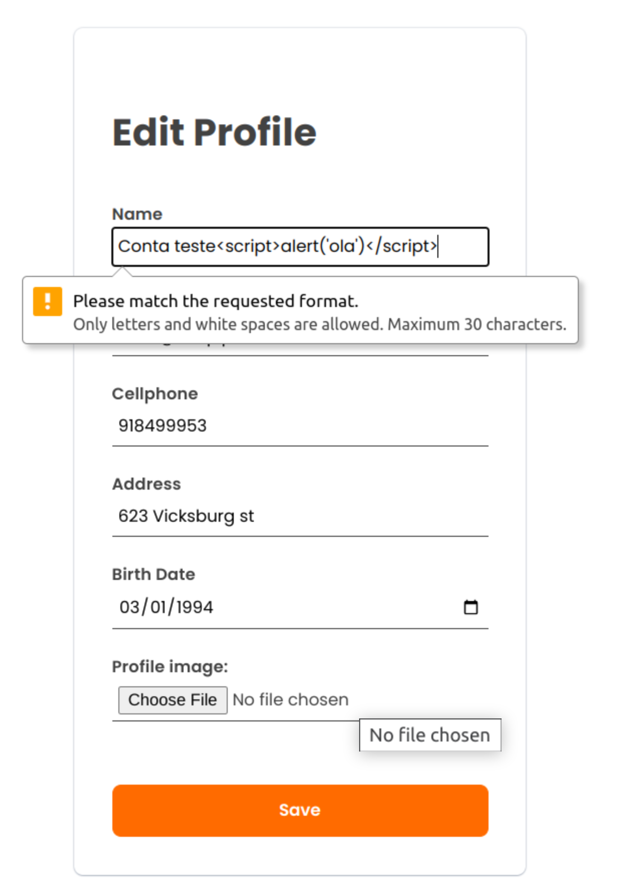
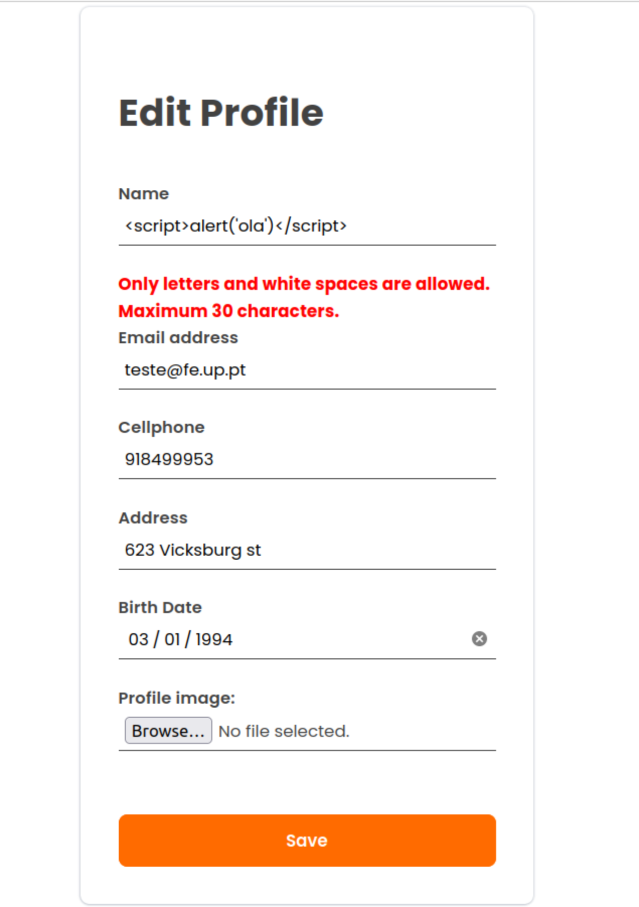

# PA: Product and Presentation

Bidding the future and Selling the past.

## A9: Product

Our website is designed to be a comprehensive information system that supports buying and selling a variety of items through a user-friendly web interface. Registered users can easily place items up for auction or bid on existing items that are available for auction. The system automatically manages the bidding process, including enforcing deadlines and determining the winning bid in a fair and transparent manner.

In addition to facilitating the auction process, our website also offers a range of tools and features to enhance the user experience. System administrators have the ability to stop auctions, block user accounts, or delete content as necessary to maintain the integrity and safety of the platform. We are dedicated to providing a reliable and enjoyable auction experience for all of our users.

Whether you are looking to sell items or find great deals on a wide range of products, InfinityAuctions is the perfect place to do it. We hope you will consider using our website for all of your buying and selling needs. 

### 1. Installation

> Link to the release with the final version of the source code in the group's Git repository.  
> `docker run -it -p 8000:80 --name=lbaw2271 -e DB_DATABASE="lbaw2271" -e DB_SCHEMA="lbaw2271" -e DB_USERNAME="lbaw2271" -e DB_PASSWORD="OOlRpmGt" git.fe.up.pt:5050/lbaw/lbaw2223/lbaw2271`

### 2. Usage

URL to the product: http://lbaw2271.lbaw.fe.up.pt 

#### 2.1. Administration Credentials

> Administration URL: URL  

| Email | Password |
| -------- | -------- |
| testeadmin@fe.up.pt    | 123456 |

#### 2.2. User Credentials

| Type          | Username  | Password |
| ------------- | --------- | -------- |
| basic account | user 1    | password |
| news editor   | user 1    | password |

### 3. Application Help

In Infinity Auctions, help has been implemented through the use of a FAQ and a contact page. The FAQ provides answers to commonly asked questions, while the contact page allows users to reach out to the company through a form or by accessing their social media profiles. Additionally, the website includes error messages that provide information on what has caused the error and how to resolve it. Overall, our website was designed to be intuitive and address any issues that users may encounter. For example, when inputting invalid information on creating an auction, the user is alerted of this.

### 4. Input Validation

In every form submission, the provided data is validated on the server-side using the built-in validation rules of Laravel. Moreover, we included two custom validation rules to properly validate the content of user's addresses (IsValidAddress) and to match the provided password with the stored one (MatchPassword) (this is required when the user is changing the password in the User page).
Furthermore, we validate the input in every form's input field using the `pattern` attribute alongside regular expressions. 
An example of front end input validation (edit profile page):
`<input type="text" name="name" pattern="^[a-zA-Z\s]{1,30}$" title="Only letters and white spaces are allowed. Maximum 30 characters." class="form-control is-invalid" placeholder="Name"`

If we disable this verification, we obtain the error messages from the server:


This form's input was validated in the server side using the following code:
```
$validated = $request->validate([
                    'name' => 'required|string|max:30|regex:/^[a-zA-Z\s]{1,30}$/',
                    'cellphone' => ['required', 'numeric', 'digits:9', Rule::unique('users')->ignore($user->id)],
                    'email' => ['required', 'email', 'max:255', Rule::unique('users')->ignore($user->id)],
                    'birth_date' => 'required|date|before:-18 years',
                    'address' => ['required', Rule::unique('users')->ignore($user->id), new IsValidAddress],
                    'profile_image' => 'mimes:jpeg,jpg,png,gif'],
                    ['birth_date.before' => "You need to be, at least, 18 years old to sign up in our website.",
                        'name.regex' => "Only letters and white spaces are allowed. Maximum 30 characters."
                    ]);
```

### 5. Check Accessibility and Usability

Accessibility: [Report](HTML_Reports/Checklist%20de%20Acessibilidade%20-%20SAPO%20UX.pdf)
Usability: [Report](HTML_Reports/Checklist%20de%20Usabilidade%20-%20SAPO%20UX.pdf)

### 6. HTML & CSS Validation
## HTML Validation:
- [About us](HTML_Reports/AboutUs.pdf)
- [Contacts](HTML_Reports/Contacts.pdf)
- [FAQ](HTML_Reports/FAQ.pdf)
- [Services](HTML_Reports/Services.pdf)
- [Create auction](HTML_Reports/sell.pdf)
- [Edit auction](HTML_Reports/Edit%20Auction.pdf)
- [Other user page](HTML_Reports/OtherUserPage.pdf)
- [Self user page](HTML_Reports/SelfUserPage.pdf)
- [Balance](HTML_Reports/Balance.pdf)
- [Auction Page](HTML_Reports/AuctionPagepdf)
- [Search Page](HTML_Reports/Search.pdf)
- [Admin Panel](HTML_Reports/AdminPanel.pdf)

## CSS Validation:
- [Admin Panel](CSS_Reports/admin_panel.pdf)
- [Auction](CSS_Reports/auction.pdf)
- [Auction Card](CSS_Reports/auction_card.pdf)
- [Auction Edit](CSS_Reports/auction_edit.pdf)
- [Balance](CSS_Reports/balance.pdf)
- [Checkout](CSS_Reports/checkout.pdf)
- [Confirmation Modal](CSS_Reports/confirmation_modal.pdf)
- [Contacts](CSS_Reports/contacts.pdf)
- [FAQ](CSS_Reports/faq.pdf)
- [Footer](CSS_Reports/footer.pdf)
- [Header](CSS_Reports/header.pdf)
- [Login](CSS_Reports/login.pdf)
- [Main](CSS_Reports/main.pdf)
- [Miligram.min](CSS_Reports/miligram.min.pdf)
- [Register](CSS_Reports/register.pdf)
- [Search page](CSS_Reports/search_page.pdf)
- [All users](CSS_Reports/search_users.pdf)
- [Create Auction](CSS_Reports/sell.pdf)
- [User](CSS_Reports/user.pdf)
- [Users](CSS_Reports/users.pdf)

### 7. Revisions to the Project

> Describe the revisions made to the project since the requirements specification stage.

### 8. Web Resources Specification

> Updated OpenAPI specification in YAML format to describe the final product's web resources.

> Link to the `a9_openapi.yaml` file in the group's repository.


```yaml
openapi: 3.0.0

...
```

### 9. Implementation Details

#### 9.1. Libraries Used
This project was implemented without the usage of any additional libraries or frameworks, besides the ones already specified in the [Computational Resources](https://docs.google.com/document/d/e/2PACX-1vQF1K-fObIOlwh8gLK-NthG6pHMN0fZRYG_RrQ-VUUaDH0gKi0YMH_-jIm-1vmslfRATS47GqaY_DvH/pub) artifact.

#### 9.2 User Stories

| US Identifier | Name                                         | Module                               | Priority | Team Members                   | State |
|---------------|----------------------------------------------|--------------------------------------|----------|--------------------------------|-------|
| US36          | View Users profile                           | M04: Users                           | High     | **Pedro Moreira**              | 100%  |
| US32          | Bid an auction                               | M05: Auctions                        | High     | **André Sousa**                | 100%  |
| US51          | Update bid                                   | M05: Auctions                        | High     | **André Sousa**                | 100%  |
| US02          | Sign-up                                      | M01: Registration and authentication | High     | **André Sousa**, Pedro Fonseca | 100%  | 
| US01          | Sign-in                                      | M01: Registration and authentication | High     | **André Sousa**, Pedro Fonseca | 100%  |
| US37          | Logout                                       | M01: Registration and authentication | High     | **André Sousa**, Pedro Fonseca | 100%  |
| US34          | Edit account                                 | M04: Users                           | High     | **Pedro Moreira**              | 100%  |
| US63          | Cancel auction                               | M05: Auctions                        | High     | **André Sousa**                | 100%  |
| US71          | Manage auctions                              | M03: Platform administration         | High     | **Pedro Moreira**              | 100%  |
| US16          | Search                                       | M05: Auctions                        | High     | **Vitor Cavaleiro**            | 100%  |
| US72          | Cancel auctions                              | M03: Platform administration         | High     | **Pedro Moreira**              | 100%  |
| US31          | Create auctions                              | M05: Auctions                        | High     | **Pedro Fonseca**              | 100%  |
| US21          | Most active auctions                         | M05: Auctions                        | Medium   | **André Sousa**                | 100%  |
| US24          | Social networks                              | M05: Auctions                        | Low      | **André Sousa**                | 100%  |
| US25          | More from this seller                        | M05: Auctions                        | Low      | **André Sousa**                | 100%  |
| US21          | Most active auctions                         | M05: Auctions                        | Medium   | **André Sousa**                | 100%  |
| US22          | New auctions                                 | M05: Auctions                        | Medium   | **André Sousa**                | 100%  |
| US35          | Bidding history                              | M05: Auctions                        | High     | **André Sousa**                | 100%  |
| US14          | Consult FAQ                                  | M02: Home page and Static pages      | High     | **Pedro Fonseca**              | 100%  |
| US11          | Home Page                                    | M02: Home page and Static pages      | High     | **Pedro Fonseca**, André Sousa | 100%  |
| US62          | Manage auction status                        | M05: Auctions                        | High     | **André Sousa**                | 100%  |
| US61          | Edit auctions                                | M05: Auctions                        | High     | **André Sousa**, Pedro Fonseca | 100%  |
| US15          | Consult Contacts                             | M02: Home page and Static pages      | High     | **Pedro Fonseca**              | 100%  |
| US13          | Consult Services                             | M02: Home page and Static pages      | High     | **Pedro Fonseca**              | 100%  |
| US12          | See About page                               | M02: Home page and Static pages      | High     | **Pedro Fonseca**              | 100%  |
| US39          | Delete account                               | M04: Users                           | Medium   | **André Sousa**, Pedro Moreira | 100%  |
| US19          | Report users                                 | M06: Reports                         | Medium   | **Pedro Moreira**              | 100%  |
| US69          | Buy it now                                   | M05: Auctions                        | Medium   | **Pedro Fonseca**              | 100%  |
| US58          | Buy now                                      | M05: Auctions                        | Medium   | **Pedro Fonseca**              | 100%  |
| US23          | Recover Password                             | M04: Users                           | Medium   | **André Sousa**                | 100%  |
| US17          | Filters                                      | M05: Auctions                        | Medium   | **Vitor Cavaleiro**            | 100%  |
| US57          | Rate a seller                                | M04: Users                           | Medium   | **André Sousa**                | 100%  |
| US40          | Follow auctions                              | M05: Auctions                        | Medium   | **Pedro Moreira**              | 100%  |
| US18          | Report auctions                              | M06: Reports                         | Medium   | **André Sousa**                | 100%  |
| US52          | Notified on new bid on participating auction | M07: Notifications                   | Medium   | **André Sousa**                | 100%  |
| US53          | Notified on participating auction ended      | M07: Notifications                   | Medium   | **André Sousa**                | 100%  |
| US54          | Notified on participating auction winner     | M07: Notifications                   | Medium   | **André Sousa**                | 100%  |
| US55          | Notified on followed auction canceled        | M07: Notifications                   | Medium   | **André Sousa**                | 100%  |
| US56          | Notified on participating auction ending     | M07: Notifications                   | Medium   | **André Sousa**                | 100%  |
| US20          | Featured items                               | M05: Auctions                        | Medium   | **Pedro Moreira**              | 100%  |
| US38          | Add funds to account                         | M04: Users                           | Medium   | **Pedro Fonseca**              | 100%  |
| US43          | Profile Picture                              | M04: Users                           | Medium   | **André Sousa**                | 100%  |
| US26          | Order search results                         | M04: Users                           | Low      | **Vitor Cavaleiro**            | 100%  |
| US59          | Max bid                                      | M05: Auctions                        | Low      | **Pedro Fonseca**              | 100%  |
| US45          | Withdraw funds                               | M04: Users                           | Low      | **Pedro Fonseca**              | 100%  |
| US42          | Notification                                 | M07: Notifications                   | Medium   | **André Sousa**                | 100%  |
| US41          | Wishlist                                     | M07: Users                           | Medium   | **Pedro Fonseca**              | 100%  |
| US74          | Delete user accounts                         | M03: Platform administration         | Medium   | **Vitor Cavaleiro**            | 100%  |
| US75          | Manage auction reports                       | M03: Platform administration         | Low      | **Vitor Cavaleiro**            | 100%  |
| US73          | Punish users                                 | M03: Platform administration         | Medium   | **Vitor Cavaleiro**            | 100%  |
---


## A10: Presentation
 
> This artifact corresponds to the presentation of the product.

### 1. Product presentation

InfinityAuctions is a cutting-edge online auction platform designed to bring users together and streamline the auction process. Whether you're an art collector, phone seller, or vintage enthusiast, our platform has something for everyone. With a user-friendly design and advanced search features, finding and bidding on the items you want has never been easier. Plus, our platform is responsive to all devices, so you can access it from your smartphone, tablet, or desktop.

In addition to making it easy to find and bid on items, InfinityAuctions also offers a range of features to help users manage their auctions and account. After creating an account, authenticated users can create new auctions, follow auctions, view their bidding history, add credit to their account, and report inappropriate users/auctions. Auction owners can edit the details of their auctions, manage their status, and cancel them if necessary. And with our team of administrators working to keep the platform safe and user-friendly through careful evaluation of user reports, you can feel confident using InfinityAuctions for all your auction needs.

URL to the product: http://lbaw2271.lbaw.fe.up.pt

Slides used during the presentation should be added, as a PDF file, to the group's repository and linked to here.

> URL to the product: http://lbaw2271.lbaw.fe.up.pt  
>
> Slides used during the presentation should be added, as a PDF file, to the group's repository and linked to here.


### 2. Video presentation

> Screenshot of the video plus the link to the lbaw2271.mp4 file.

> - Upload the lbawYYgg.mp4 file to Moodle.
> - The video must not exceed 2 minutes.
---


## Revision history

Changes made to the first submission:
1. ..

***
GROUP2271, 03/01/2023

* André Sousa, up202005277@fe.up.pt
* Pedro Moreira, <span dir="">up201905429@fe.up.pt</span>
* Pedro Fonseca, up202008307@fe.up.pt
* Vítor Cavaleiro, <span dir="">up202004724@edu.fe.up.pt</span>
